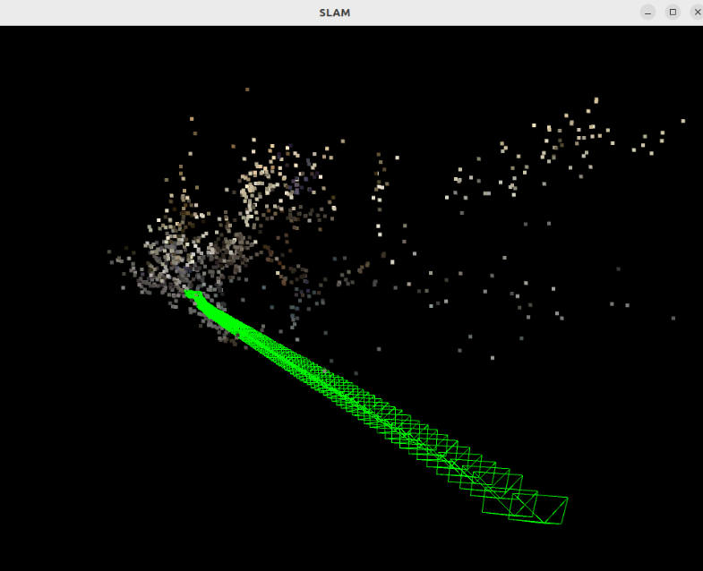

# Simple-SLAM

A simple implementation of sparse SLAM (Simultaneous Localization and Mapping) using Python.





## Tasks

- [x] Feature detection using ORB feature detection or Shi-Tomasi corner detection.
  - [x] Shi-Tomasi corner detection.
  - [ ] ORB features are clustered -- ANMS?
- [x] Feature matching using Brute Force Matching (knn matching -- no cross checks).
  - [x] Clean up matches using ratio test -- takes care of most outlier matches.
  - [x] Clean up remaining matches using alternative methods -- RANSAC with Essential Matrix.
- [x] Get rotation and translation from Essential Matrix.
  - [x] Fix bug: error in translation vector.
- [x] Triangulate 3D points from the matched features.
  - [x] Implement a Map class to store the 3D points.
  - [x] Build Pangolin library.
  - [x] Visualize the 3D map using Pangolin.
  - [x] Fix Bug: Camera Drift in XY Plane during Slow Movement --> caused by error in intrinsic matrix.
- [x] Tracking of points over multiple frames.
  - [x] Implement a Point class to store the 2D-3D correspondences.
  - [x] Track the points over multiple frames.
- [x] g2o based optimization.
  - [x] Build g2opy library.
  - [x] Implement the optimizer.
  - [x] Fix bug: Optimizer giving wrong results --> used normalized coordinates alongside unnormalized intrinsics.
  - [x] Add point color from image in 3d visualization.
  - [ ] Improve accuracy of points.
- [ ] point culling.

## TODO

- Integrate more advanced SLAM features.
- Optimize performance for real-time processing.

## Usage

1. **Feature Detection:**

   - ORB feature detection
   - Shi-Tomasi corner detection

2. **Feature Matching:**

   - Brute Force Matching
   - Ratio test for cleaning up matches
   - RANSAC with Essential Matrix to remove outlier matches

3. **Rotation and Translation Estimation:**

   - Estimation of rotation and translation from the Essential Matrix.

4. **Triangulation:**

   - Triangulation of 3D points using Direct Linear Transform (DLT).

5. **Mapping:**

   - Check for existing 3D points in the map.
   - Add new 3D points to the map.
   - Visualize the 3D map using Pangolin.

6. **Optimization:**
   - g2o based optimization.

## Installation

This project is coded using Python 3.7.12. This is because g2opy and Pangolin python bindings are only working with Python 3.7 as of now.

The graph optimization is done using g2opy. The g2opy library is a Python binding for the g2o library. The g2o library is an open-source C++ framework for optimizing graph-based nonlinear error functions. To install g2opy, use this repo:

https://github.com/uoip/g2opy

The 3D visualization is done using Pangolin. The Pangolin library is a lightweight portable rapid development library for managing OpenGL display / interaction and abstracting video input. Pangolin library is used alongside OpenGL library to visualize the 3D map. To install Pangolin, use this repo:

https://github.com/uoip/pangolin


To install the remaining python dependencies, run:

```sh
pip install -r requirements.txt
```

To run the program:

```sh
D2D=1 D3D=1 ./slam.py --video <video_file>
```
